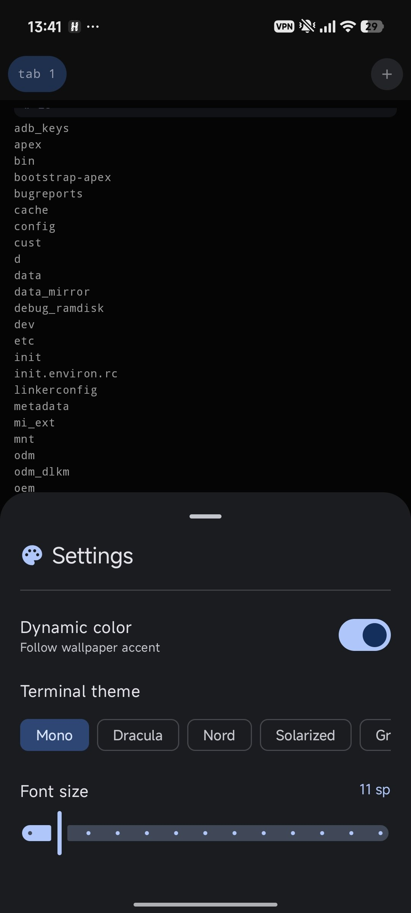

# Rooterm

Lightweight, customizable terminal emulator for Android with root shell support.

## Features

* Root shell support via KernelSU / su
* Multiple terminal tabs
* Material You inspired UI
* Custom terminal themes
* Adjustable font size
* Session management
* Modern Jetpack Compose interface

## Screenshots

<p align="center">
  
  
</p>

<p align="center">
  <b>Main terminal</b> &nbsp;&nbsp;&nbsp;&nbsp;&nbsp;&nbsp;&nbsp;&nbsp;
  <b>Settings</b>
</p>

## Requirements

* Root access (KernelSU recommended)

## Building

Clone the repository:

```bash
git clone https://github.com/savo-o/rooterm.git
cd rooterm
```

Build debug APK:

```bash
./gradlew assembleDebug
```

The APK will be generated in:

```text
app/build/outputs/apk/debug/
```

## Project Status

Rooterm is currently in development.

Known issues:

* Some terminal features are still experimental
* Not fully tested on all Android versions

## License

GPL 2.0 License
