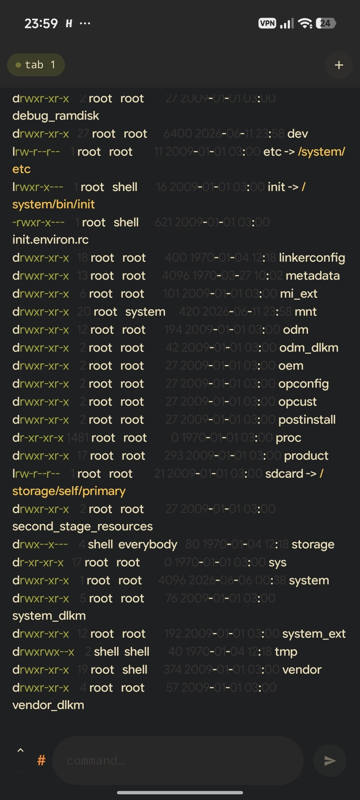

# Rooterm

Lightweight terminal emulator for Android with root shell support.

## Features

* Root shell support via KernelSU / su
* Multiple terminal tabs
* Material You inspired UI
* Custom terminal themes
* Adjustable font size
* Session management
* Modern Jetpack Compose interface

## Screenshots



## Requirements

* Root access (KernelSU recommended)

## Building

Clone the repository:

```bash
git clone https://github.com/savo-o/rooterm.git
cd rooterm
```

Build debug APK:

```bash
./gradlew assembleDebug
```

The APK will be generated in:

```text
app/build/outputs/apk/debug/
```

## Project Status

Rooterm is currently in early development.

Known issues:

* Performance may degrade with very large terminal output
* Some terminal features are still experimental
* Not fully tested on all Android versions

Warning:

* Rooterm is in early development and has not undergone a security audit.
* This software executes commands with root privileges and may contain bugs, security issues, or unexpected behavior.
* Use at your own risk and avoid running it on devices or environments that contain sensitive data.

## License

GPL 2.0 License
